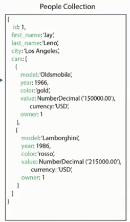

# Diseño basico de esquemas

- Diferencias entre el diseño de esquemas de MongoDB y el modelo relacional
- La importancia del diseño de esquemas en MongoDB
- Por qué casi todos los problemas de rendimiento tienen su origen en el diseño de esquemas
- Cómo establecer un vocabulario y una metodología comunes que faciliten el diseño 
de esquemas para MongoDB.

## Queremos que sea capaz de ...

- Comprender algunas de las funciones del modelo de documentos
- Dar al modelo de documentos el uso que tiene en mente
- Adaptar el esquema a su carga de trabajo

## Consideraciones acerca del diseño de esquemas

- Factores que afectan al diseño de esquemas
    - Patrones de acceso a los datos
    - N. de operaciones de lectura y N. de actualizaciones
    - Tamaño previsto del documento

## Por qué es importante todo esto ? 

Casi todos los problemas de rendimiento tienen su origen
en el diseño de esquemas.

# Inclusión de documentos

- En una base de datos relacional se construiria de la siguiente manera

- En mongoDb seria de la siguiente manera
