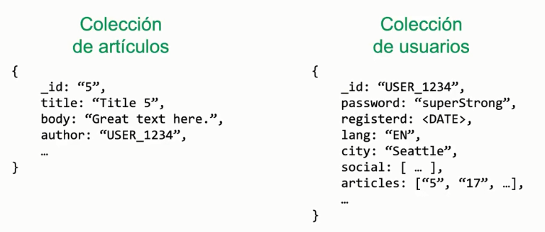

# Referencia a Documentos

- Cuando el usuario tiene una relacion de uno a
muchos articulos, y viseversa que cada articulo tiene una relacion de muchos a uno con un usurio

## Entonces , cuando definir que un Documento puede tener un Array de documentos o separarlo en otra coleccion y hacer referencia a este

- Podria determinarse que en el caso en que el array sobre pase los 16 mb (unos 1000 articulos) , entonces no es buena decicion guardar dichos articulos dentro del mismo usuario.

