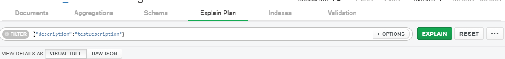
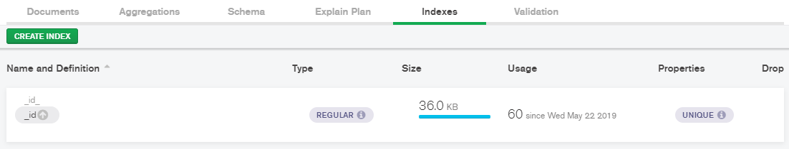
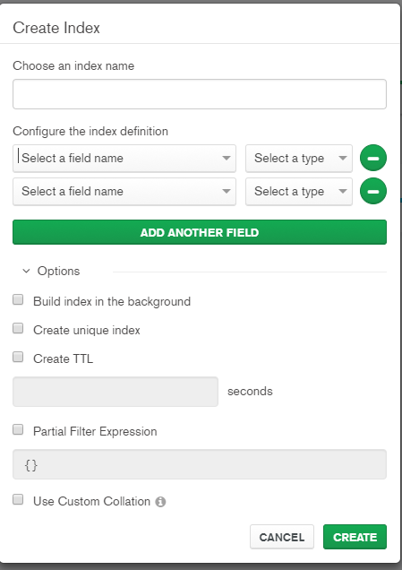

# Indices

Un indice basicamente sirve para agilizar las consultas.
son una lista organizada de valores que sirven como referencia de busqueda


## Crear Indices usando Compass

- Primero podemos ver el plan de las consultas , en la pestaña de Explain Plan


En este se puede observar paso a paso como se realiza la consulta y el tiempo que toma,
Esto ayuda a comparar la mejora cuando se utilizan los indices , ya que se puede ver el 
antes y el despues.

- Para crear un indice desde Compass


Se puede crear un indice por varios campos como se muestra en la imagen


Se recomienda que los primeros campos sean aquellos de comparacion 
es decir "campo = value" , luego los campos de ordenamiento o de rango.


## Como afectan los indices a la insercion o edicion ?

Ya que al insertar o actualizar un dato tambien se debe de actualizar el indice correspondiente se llega
a doblar el tiempo de respuesta.

Es decir que si normante se insertan 100.000 registros por segundo , cuando utilizamos indices
insertaria 50.000 registros por segundo.

Esto sucede cada 3 indices y es algo importante a tener en cuenta.

## Tipos de indices en MongoDB

Compo unico { karma: 1}
Campo compuesto { karma: 1, user_id: -1 }
Varias claves(en Arrays) { "address.postal_code" : 1}
Geoespacial
Texto
Hash


## Propiedades de los indices

- Unicos
- Parciales o Dispersos (Evitanto que busque en documentos que tienen o no ciertos campos)
- TTL (Borra documentos despues de cierto tiempo)

## Obtener y Crear indices de Shell

- Obtener el listados de indices
``` javascript
db.basededatos.getIndexes()
/*//*
    [
        {
            "v": 2,
            "key":{
                "_id": 1
            },
            "name": "_id_",
            "ns": "test.containers"
        },
        {
            "v": 2,
            "key":{
                "location": "2dsphere"
            },
            "name": "location_2dsphere",
            "ns": "test.containers", 
        }
    ]
*/
```

- Crear un indice

``` javascript
db.database.createIndex({
    campo: 1 // tipo de orden acendente 1 descendente -1
})

  /*
     {
         "createCollectionAutomatically": false,
         "numIndexesBefore": 3,
         "numIndexesAfter": 4,
         "ok": 1
     }
    */
```