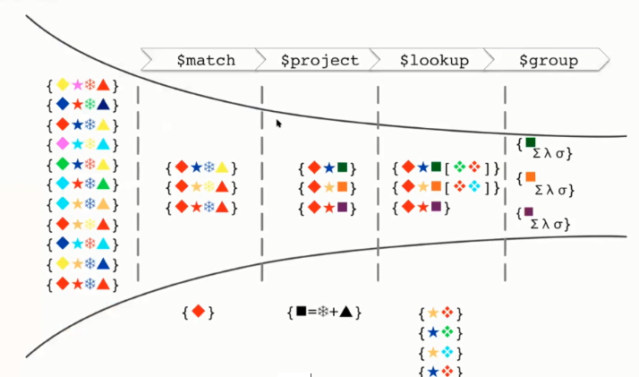

# Aggregation Pipeline

Es la forma de hacer consultas de forma secuencial a medida que los 
datos concuerdan en cada paso de las consultas.s

Todo esto para hacer consultas mucho mas complejas , para manipular y transformar documentos.

Para ello mongoDB brinda la herramienta del Aggregation Framework.
